# 📹 video-to-brain

> **🌐 English** | **[中文](README.md)**

[](https://github.com/LunaAI519/video-to-brain/actions/workflows/test.yml)
[](https://codecov.io/gh/LunaAI519/video-to-brain)
[](https://www.python.org/downloads/)
[](https://opensource.org/licenses/MIT)
[](https://github.com/LunaAI519/video-to-brain/releases)
[](https://github.com/LunaAI519/video-to-brain#-docker-one-click-deploy)
[](https://railway.com/template/video-to-brain?referralCode=LunaAI519)
[](https://twitter.com/LunaAI519)

**Send a video on your phone. AI takes notes for you.**

Not just transcription — real notes with key takeaways, quotes, action items, auto-categorized into Obsidian.

> 🎯 Built by a non-coder using vibe coding. If I can build this, you can too.

```
┌──────────┐    ┌──────────────┐    ┌─────────┐    ┌──────────┐    ┌──────────┐
│ 📱 Phone  │───▶│ 🤖 Telegram  │───▶│ 🎙️ AI   │───▶│ 🧠 Smart  │───▶│ 📚 Vault  │
│ Send/Fwd  │    │  Bot         │    │ Transcr. │    │ Analysis  │    │ Obsidian │
│ Video     │    │ (up to 2GB)  │    │(Whisper) │    │  (LLM)    │    │ Auto-sort│
└──────────┘    └──────────────┘    └─────────┘    └──────────┘    └──────────┘
```

<p align="center">
  
  <br>
  <em>Send video → 30s later get AI notes → auto-saved to Obsidian</em>
</p>

**📸 See what the notes look like:** [Study note example](docs/demo/sample-note-study.md) · [Content note example](docs/demo/sample-note-content.md)

---

## 🤔 Before vs After

**Without this tool:**
```
See a great video → "I'll take notes later" → Forget → Never find it again
                                                 ↑
                                           90% of people stop here
```

**With video-to-brain:**
```
See a great video → Forward to bot → 30 seconds later:
  ✅ One-line summary
  ✅ 5 key takeaways
  ✅ Notable quotes
  ✅ Action items
  ✅ Auto-saved to Obsidian with timestamps
```

**What you save:**
- 🕐 A 30-minute video takes 20 minutes to manually summarize. This tool does it in 2 minutes.
- 🧠 Not just transcription — it understands the content and gives you usable notes.
- 🔍 3 months later, "what did that video say?" — just search in Obsidian.

---

## ✨ Features

### 🤖 AI-Powered Notes (Not Just Transcription)

Same video, different templates, completely different notes:

**📚 Study Mode** — Key concepts + explanations + further thinking
```markdown
## 🔑 Key Takeaways
1. RAG has three key steps: indexing, retrieval, generation
2. Vector DB choices: Pinecone for production, Chroma for prototyping

## 📖 Concepts
- RAG (Retrieval-Augmented Generation): Makes AI search before answering...

## 🧠 Further Thinking
- How much would knowledge graphs improve RAG accuracy?
```

**🎙️ Meeting Mode** — Discussion points + decisions + action items
```markdown
## 🔑 Key Points
1. Q2 budget needs 15% cut, marketing first

## ✅ Decisions
- New product launch delayed to Q3

## ✅ Action Items
- [ ] Finance team: submit revised budget by Friday
- [ ] Product team: update release timeline
```

**✍️ Content Mode** — Hot takes + tweet drafts
```markdown
## 🔥 Hot Takes
- 99% of people use AI for chatting. Only 1% use AI to make money.

## 🐦 Tweet Drafts
Draft 1:
> You think AI is a chatbot? Others are making millions with it. The gap isn't the tool — it's the mindset.
```

**📰 News Mode** — Core arguments + key data + reflections
```markdown
## 🔑 Core Arguments
1. AI Agent market to reach $50B in 2025

## 📊 Key Data
- GPT-4o: 3x faster, 50% cheaper

## 🧠 Reflections
- What does this mean for solo developers?
```

### ⏱️ Timestamp Navigation

Notes automatically include video timestamps for easy reference:

```markdown
## ⏱️ Timeline
- **`00:00`** Intro — three common AI startup mistakes...
- **`03:25`** Mistake #1: thinking you need to code...
- **`08:10`** Mistake #2: waiting for perfection before shipping...
- **`15:30`** Live demo: building a tool in 30 min with vibe coding...
```

### 🔓 Break the 20MB Limit

```
Standard (Bot API):    Phone → Telegram → Bot API → ❌ 20MB limit
video-to-brain:        Phone → Telegram → MTProto → ✅ Up to 2GB
```

A 30-minute video can be 200MB+. Telegram Bot API only handles 20MB. We use Pyrogram's MTProto protocol to bypass this limit entirely.

### 📱 Works from Your Phone

No computer needed. See a great video on your phone, forward it to the bot, done. Forwarded videos work too.

---

## 🚀 Quick Start

### Requirements

- Python 3.10+
- ffmpeg (audio extraction)
- Whisper (speech-to-text)
- Telegram Bot Token
- _(Optional)_ Telegram API ID & Hash — for videos > 20MB
- _(Optional)_ LLM API Key — for AI-powered notes

### Install

```bash
# 1. Clone
git clone https://github.com/LunaAI519/video-to-brain.git
cd video-to-brain

# 2. Install dependencies
pip install -r requirements.txt

# 3. Install ffmpeg
# macOS:
brew install ffmpeg
# Linux:
sudo apt install ffmpeg

# 4. Install Whisper
pip install openai-whisper
```

### Configure

```bash
cp .env.example .env
```

Edit `.env`:

```env
# Required
TELEGRAM_BOT_TOKEN=***

# Optional: large video support
TELEGRAM_API_ID=your_api_id
TELEGRAM_API_HASH=your_api_hash

# Optional: AI-powered notes (OpenAI / Claude / Ollama / etc.)
LLM_API_KEY=***
LLM_BASE_URL=https://api.openai.com/v1
LLM_MODEL=gpt-4o-mini

# Use local Ollama (completely free):
# LLM_BASE_URL=http://localhost:11434/v1
# LLM_MODEL=llama3
# LLM_API_KEY=***

# Note save path
OBSIDIAN_VAULT=~/Documents/my-vault
```

**How to get a Telegram API ID:**
1. Go to https://my.telegram.org
2. Log in with your phone number
3. Click "API development tools"
4. Fill in the app name and description
5. You'll get an API ID (number) and API Hash

### Run

```bash
python bot.py
```

Bot commands:
- `/start` — Check status
- `/help` — Usage guide
- `/template` — Switch note template (study/meeting/news/content/auto)
- `/vault <path>` — Change save location
- `/status` — View current settings

### Three Tiers

| | Basic | Standard | Full |
|---|---|---|---|
| Transcription | ✅ | ✅ | ✅ |
| Timestamps | ✅ | ✅ | ✅ |
| Large videos (>20MB) | ❌ | ✅ | ✅ |
| AI-powered notes | ❌ | ❌ | ✅ |
| Setup needed | Bot Token | + API ID/Hash | + LLM API Key |
| Cost | Free | Free | LLM API costs |

### Use as a Python Library

```python
from src import video_to_text, generate_note
from src.ai_processor import analyze_transcript

# Transcribe with timestamps
text, timestamps, duration = video_to_text("video.mp4", with_timestamps=True)

# AI analysis
analysis = analyze_transcript(text, template="study")

# Generate note
note_path = generate_note(
    transcript=text,
    output_dir="~/Documents/my-vault/",
    ai_analysis=analysis,
    timestamps=timestamps,
    duration_seconds=duration,
)
```

---

## 🐳 Docker One-Click Deploy

Don't want to mess with ffmpeg/Whisper installation? Use Docker:

```bash
# 1. Clone + configure
git clone https://github.com/LunaAI519/video-to-brain.git
cd video-to-brain
cp .env.example .env
# Edit .env with your tokens

# 2. Launch
docker compose up -d

# View logs
docker compose logs -f
```

That's it. ffmpeg, Whisper — all installed automatically.

---

## 🔒 Security

- **Access Control** — `ALLOWED_USERS` whitelist, only approved users can use the bot
- **Rate Limiting** — `RATE_LIMIT` prevents abuse (default: 5 requests/min)
- **Secret Isolation** — All sensitive data stays in `.env`, never in code
- **Security Policy** — [SECURITY.md](SECURITY.md) defines vulnerability reporting

```env
# Configure whitelist in .env (strongly recommended)
ALLOWED_USERS=123456789,987654321
RATE_LIMIT=5
```

---

## 📁 Project Structure

```
video-to-brain/
├── src/
│   ├── __init__.py           # Package entry
│   ├── env_loader.py         # Shared env config
│   ├── large_download.py     # Pyrogram large video download (>20MB)
│   ├── transcriber.py        # ffmpeg + Whisper transcription + timestamps
│   ├── note_generator.py     # Obsidian note generation (AI templates)
│   └── ai_processor.py       # LLM analysis (4 templates)
├── tests/                    # Test suite
├── examples/
│   └── basic_usage.py        # Usage example
├── docs/
│   └── telegram-setup.md     # Telegram setup guide
├── bot.py                    # Telegram Bot entry point
├── Dockerfile                # Docker image
├── docker-compose.yml        # Docker Compose config
├── .env.example              # Environment template
├── requirements.txt          # Python dependencies
├── LICENSE                   # MIT License
└── README.md
```

---

## 💡 Use Cases

| Scenario | How | Recommended Template |
|---|---|---|
| 📚 Great tutorial video | Forward to bot | Study |
| 🎙️ Meeting / call recording | Send to bot | Meeting |
| 📰 Podcast / interview / news | Forward it | News |
| ✍️ Looking for content ideas | Send video, extract insights | Content |
| 📋 Not sure what type | Let AI decide | Auto |

---

## 🤖 Works with Hermes

This project was originally built as a video processing module for [Hermes](https://github.com/hermes-ai/hermes-agent) AI assistant.

If you're using Hermes, this feature is built in:
1. Send a video to Hermes on Telegram
2. Say "turn this into notes"
3. Auto-transcribe + AI analysis + saved to Obsidian

---

## 🙋 FAQ

**Q: I can't code. Can I use this?**
A: This project was built by someone who can't code. Just follow the install guide step by step.

**Q: Does AI analysis cost money?**
A: Works without LLM config (basic transcription is free). With LLM, costs depend on your model. gpt-4o-mini is cheap — a few cents per video. Or use Ollama locally for free.

**Q: How accurate is the transcription?**
A: Whisper handles Chinese and English very well. For domain-specific terms, add `initial_prompt` in `.env` for hints.

**Q: Do I need a GPU?**
A: No. The turbo model runs on CPU — about 2-3 minutes for a 10-minute video. GPU makes it faster.

**Q: What video formats?**
A: mp4, mov, avi, mkv, webm — anything ffmpeg can handle.

**Q: Can I forward other people's videos?**
A: Yes. Forwarded videos automatically include source attribution.

**Q: Can notes auto-sort into different Obsidian folders?**
A: Yes. AI categorizes content automatically (study → knowledge base, business → business folder, etc.).

---

## 🛣️ Roadmap

- [x] Local Whisper transcription
- [x] Break 20MB limit (MTProto)
- [x] AI-powered notes (4 templates)
- [x] Timestamp navigation
- [x] Forwarded video support
- [x] Auto-categorize to Obsidian folders
- [ ] Batch processing (queue multiple videos)
- [ ] Voice message support
- [ ] Web UI (use without Telegram)
- [ ] Cross-language summaries (English video → Chinese notes)

---

## 📄 License

MIT — Use freely, no permission needed.

---

## 🌟 About

I'm Luna. Financial management, zero coding background.

Started building my own tools with AI + vibe coding in 2025. This is my first open-source project.

**The origin story:** I was out all day, came across several great videos. Wanted to send them to AI for note-taking. But Telegram has a 20MB limit. Couldn't send them.

This bugged me for half a day. Then I solved it with vibe coding.

**You don't need to become a programmer. You just need to know what the problem is.**

AI handles the how. You decide the what.

---

⭐ If this is useful, give it a Star!

[](https://twitter.com/LunaAI519)

---

## 📈 Star History

<a href="https://star-history.com/#LunaAI519/video-to-brain&Date">
 <picture>
   <source media="(prefers-color-scheme: dark)" srcset="https://api.star-history.com/svg?repos=LunaAI519/video-to-brain&type=Date&theme=dark" />
   <source media="(prefers-color-scheme: light)" srcset="https://api.star-history.com/svg?repos=LunaAI519/video-to-brain&type=Date" />
   
 </picture>
</a>
